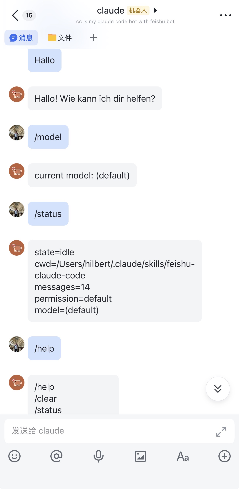
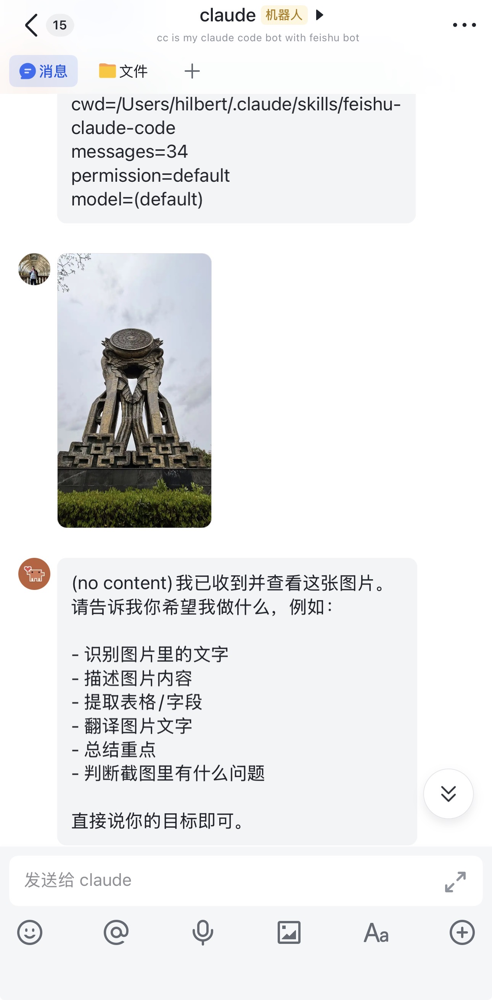
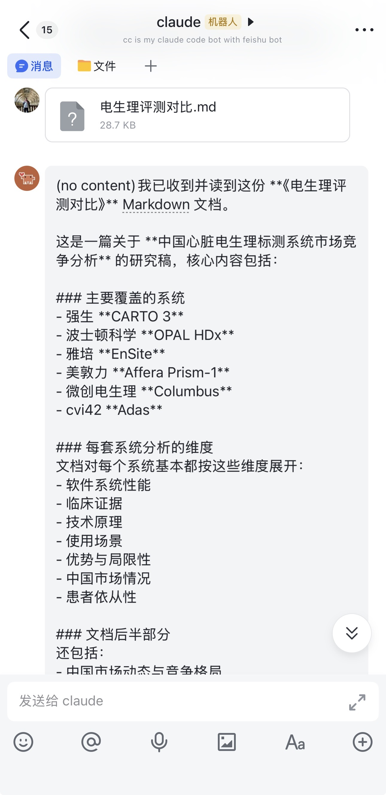

# Dardanus / macOS Dock Hermit Crab Pet for Feishu Claude Code

[](./LICENSE)
[](https://nodejs.org/)
[](https://www.typescriptlang.org/)
[](https://open.feishu.cn/)
[](https://claude.ai/code)

Dardanus is a macOS Dock hermit crab desktop pet that launches and supervises a local Feishu-to-Claude Code bridge. Open the pet to start the bridge and Cloudflare tunnel, chat from Feishu on your phone, and watch Dardanus react as Claude thinks, replies, or receives files.

Dardanus 是一个面向 macOS Dock 的寄居蟹桌宠：打开它即可启动本地 Feishu 到 Claude Code 的桥接与 Cloudflare tunnel；在手机飞书里对话时，它会用睡觉、挥钳、爬行、眨眼、吐泡等状态反馈 Claude 和飞书消息活动。项目当前重心已转向这个桌宠入口，桥接能力作为 Dardanus 的本地通信内核继续演进。

| 截图 1 | 截图 2 | 截图 3 |
| :---: | :---: | :---: |
|  |  |  | 


## Table of Contents / 目录

- [Overview / 项目概览](#overview--项目概览)
- [Features / 功能特性](#features--功能特性)
- [Architecture / 架构说明](#architecture--架构说明)
- [Dardanus Dock Pet / Dardanus Dock 寄居蟹桌宠](#dardanus-dock-pet--dardanus-dock-寄居蟹桌宠)
- [Requirements / 环境要求](#requirements--环境要求)
- [Quick Start / 快速开始](#quick-start--快速开始)
- [Installation / 安装](#installation--安装)
- [Configuration / 配置](#configuration--配置)
- [Feishu Setup / 飞书开放平台配置](#feishu-setup--飞书开放平台配置)
- [Running the Bridge / 运行方式](#running-the-bridge--运行方式)
- [Cloudflare Tunnel / Cloudflare Tunnel](#cloudflare-tunnel--cloudflare-tunnel)
- [Attachment Handling / 附件处理策略](#attachment-handling--附件处理策略)
- [Commands / 命令](#commands--命令)
- [Verification Checklist / 验证清单](#verification-checklist--验证清单)
- [Security & Privacy / 安全与隐私](#security--privacy--安全与隐私)
- [Known Limitations / 当前限制](#known-limitations--当前限制)
- [Development / 开发](#development--开发)
- [Author / 作者](#author--作者)
- [License / 许可证](#license--许可证)

## Overview / 项目概览

This project runs a local daemon that receives Feishu message events, keeps a per-chat Claude session, downloads supported attachments to a local runtime directory, and lets Claude inspect those local files before answering.

本项目运行一个本地 daemon：接收飞书消息事件、为每个聊天维护独立 Claude 会话、把支持的附件下载到本地 runtime 目录，并让 Claude 在回复前按需检查这些本地文件。

The bridge is intentionally lightweight. It does not embed a heavy OCR or document parsing stack inside Node.js. Instead, it stages local files, builds attachment-aware prompts, and lets Claude Code use its own native file, image, and PDF capabilities.

桥接层刻意保持轻量，不在 Node.js 内嵌厚重的 OCR 或文档解析栈，而是负责把附件安全落地、构造附件感知 prompt，再交给 Claude Code 使用已有的本地文件、图片与 PDF 能力处理。

## Features / 功能特性

- Receive Feishu event subscription webhooks / 接收飞书事件订阅 Webhook
- Support challenge verification and schema 2.0 events / 支持 challenge 校验与 schema 2.0 事件
- Decrypt encrypted Feishu payloads / 支持加密事件体解密
- Maintain one Claude session per `chat_id` / 为每个 `chat_id` 维护独立 Claude 会话
- Download images and files to `~/.feishu-claude-code/runtime/...` / 下载图片和文件到 `~/.feishu-claude-code/runtime/...`
- Forward text, image, file, and rich-link context into Claude / 将文本、图片、文件、富文本链接上下文交给 Claude
- Use attachment-aware prompt guidance for images, PDFs, text-like files, and office documents / 为图片、PDF、文本类文件与 Office 文档提供附件感知 prompt 指引
- Support Feishu-side approval via `y` / `n` for Claude tool permissions / 支持在飞书里用 `y` / `n` 审批 Claude 工具权限
- Provide slash-style commands such as `/help`, `/status`, `/model`, `/permission`, `/skills` / 提供 `/help`、`/status`、`/model`、`/permission`、`/skills` 等命令
- Run in foreground or daemon mode / 支持前台运行或 daemon 后台运行
- Launch Dardanus, the macOS hermit crab desktop pet that starts/supervises the bridge and tunnel, then reflects bridge, tunnel, Claude, and Feishu activity states / 启动 Dardanus 这个 macOS 寄居蟹桌宠，由桌宠启动和守护 bridge 与 tunnel，并映射 bridge、tunnel、Claude 与飞书消息状态
- Drag Dardanus freely around the screen, with magnetic snapping near screen edges and the Dock band / 支持在屏幕任意位置拖动 Dardanus，并在屏幕边缘与 Dock 区域附近磁吸贴靠
- Planned expansion to WeChat and WeCom through OpenClaw-style QR login adapters after the Feishu path is stable / 飞书路径稳定后，计划通过 OpenClaw 风格的扫码登录适配器继续接入 WeChat 与 WeCom

## Architecture / 架构说明

1. Feishu sends an event subscription webhook to the local bridge.
2. The bridge verifies and optionally decrypts the event payload.
3. Supported attachments are downloaded to a local runtime directory.
4. The bridge builds an attachment-aware prompt and resumes the matching Claude session.
5. Claude reads local files or uses image/PDF capabilities when needed.
6. The final text reply is sent back to Feishu.

1. 飞书将事件订阅 Webhook 发送到本地桥接服务。
2. 桥接服务校验并按需解密事件体。
3. 支持的附件会被下载到本地 runtime 目录。
4. 桥接服务构造附件感知 prompt，并恢复对应的 Claude 会话。
5. Claude 按需读取本地文件或调用图片 / PDF 处理能力。
6. 最终文本回复回发到飞书。

## Dardanus Dock Pet / Dardanus Dock 寄居蟹桌宠

The `crab-pet/` app is Dardanus, a Tauri desktop companion for macOS named after a real hermit crab genus. Opening Dardanus starts and supervises the Feishu bridge and Cloudflare tunnel. The pet renders with transparent PNG sprites, can be dragged freely around the screen, and uses the bridge `/status` and `/events` endpoints to show activity.

`crab-pet/` 是 Dardanus，一个以真实寄居蟹属命名的 macOS Tauri 桌面伴侣。打开 Dardanus 会启动并守护 Feishu bridge 与 Cloudflare tunnel。桌宠使用透明 PNG 精灵渲染，可在屏幕任意位置拖动，并通过 bridge 的 `/status` 与 `/events` 端点展示活动状态。

Prototype and production assets / 原型与当前生产资产：

| Prototype sprite sheet / 原型状态图 | App icon / 应用图标 | Sleep state / 离线睡眠 |
| :---: | :---: | :---: |
|  |  |  |

State mapping / 状态映射：

- `sleep`: bridge or tunnel is offline; uses a dedicated tucked-shell `Zzz` sprite / bridge 或 tunnel 离线；使用专门的缩壳闭眼 `Zzz` 图片
- `awake`: bridge and tunnel are online; default idle awake state / bridge 与 tunnel 在线；默认醒着状态
- `wave-claw`: one-shot wave every minute while awake, lasting about 5 seconds / 醒着时每分钟挥钳一次，约 5 秒
- `idle-shrink`: after about 5 minutes awake without higher-priority activity / 醒着空闲约 5 分钟后缩壳休息
- `crawl`: Claude is thinking/streaming, or a double-click interaction; the window crawls left at about 16 px/s and wraps back from the left edge to the right edge / Claude 思考或输出中，或双击互动；窗口以约 16 px/s 向左爬行，到左侧边缘后从右侧穿越回来
- `wink`: recent non-text Feishu input such as image, audio, media, or file / 最近收到图片、语音、media 或文件等非文本消息
- `bubbling`: reply completed, single click, or hover/hold intent for recent activity / 回复完成、单击或悬停意图触发吐泡
- `shrink`: more than three clicks in a burst; holds for about 10 seconds / 快速点击超过三次触发缩壳，保持约 10 秒

Interaction notes / 交互说明：

- Right click Dardanus to open its menu: `Wake` relaunches the local bridge daemon, `Setup` opens the onboarding guide, `Reload` snaps near the Dock and refreshes status, and `Quit` exits the pet / 右键 Dardanus 会打开菜单：`Wake` 重新拉起本地 bridge daemon，`Setup` 打开入门导览，`Reload` 贴近 Dock 并刷新状态，`Quit` 退出桌宠
- Press and drag on the crab to move it anywhere on screen; it stays free while dragging and only snaps lightly after release near a screen edge or Dock band / 按住寄居蟹可在屏幕任意位置拖动；拖动过程中保持自由，只有松手后靠近屏幕边缘或 Dock 区域才轻量磁吸
- First-run onboarding lets users choose an IM client, open the corresponding registration guide, paste copied keys, save local Claude Code bridge config, and wake the bridge / 首次运行导览允许用户选择 IM 客户端、打开对应注册页面、粘贴复制好的 key、写入本地 Claude Code bridge 配置并唤醒桥接
- Future IM adapters can reuse the same pet state model after Feishu, including WeChat and WeCom QR-login channel bundles for Claude Code / 后续 WeChat 与 WeCom 扫码入口会作为 Claude Code 的 IM channel bundle 复用同一套桌宠状态模型

Future IM adapters / 后续 IM 适配：

- WeChat reference: [Tencent/openclaw-weixin](https://github.com/Tencent/openclaw-weixin), used as QR-login channel design reference rather than a required runtime dependency / WeChat 参考：[Tencent/openclaw-weixin](https://github.com/Tencent/openclaw-weixin)，作为扫码登录通道设计参考，而不是必需运行时依赖
- WeCom reference: [WecomTeam/wecom-openclaw-plugin](https://github.com/WecomTeam/wecom-openclaw-plugin), used as enterprise IM workflow reference for a future Dardanus Claude Code channel / WeCom 参考：[WecomTeam/wecom-openclaw-plugin](https://github.com/WecomTeam/wecom-openclaw-plugin)，作为未来 Dardanus Claude Code 企业 IM 通道的工作流参考
- Current Setup writes working Feishu/Lark bridge credentials today and stores WeChat/WeCom as planned channel profiles until their Claude Code bundles land / 当前 Setup 会写入可用的 Feishu/Lark bridge 凭据；WeChat/WeCom 会先保存为 planned channel profile，等待后续 Claude Code bundle 落地

Build the macOS app / 构建 macOS App：

```bash
cd ~/.claude/skills/feishu-claude-code/crab-pet
npm install
npm run tauri -- build
```

The local `.app` bundle is generated at:

本地 `.app` 会生成在：

```text
crab-pet/src-tauri/target/release/bundle/macos/Dardanus.app
```

Packaged macOS app binaries are intentionally not committed to this repository. Publish them separately through GitHub Releases.

打包后的 macOS App 二进制不会提交到仓库；请通过 GitHub Releases 单独发布。

## Requirements / 环境要求

- Node.js 18+ (Node 20+ recommended) / Node.js 18+（推荐 Node 20+）
- Claude Code with local tool access / 本地可用的 Claude Code
- A Feishu app with event subscription enabled / 已开启事件订阅的飞书应用
- A public HTTPS endpoint, typically via Cloudflare Tunnel / 一个公网 HTTPS 地址，通常通过 Cloudflare Tunnel 暴露
- GitHub CLI (`gh`) if you want to publish from the terminal / 若要从终端发布到 GitHub，建议安装 GitHub CLI (`gh`)

## Quick Start / 快速开始

```bash
cd ~/.claude/skills/feishu-claude-code
npm install
npm run setup
npm run build
npm run start
```

Then expose the local server with your public HTTPS endpoint and configure the Feishu event subscription callback URL.

然后使用公网 HTTPS 地址暴露本地服务，并在飞书后台配置事件订阅回调地址。

## Installation / 安装

Or, clone or place this project under your local Claude skills directory, then install dependencies:

将本项目放到本地 Claude skills 目录后，安装依赖：

```bash
cd ~/.claude/skills/feishu-claude-code
npm install
```

Build the TypeScript sources:

构建 TypeScript 源码：

```bash
npm run build
```

## Configuration / 配置

Required environment variables / 至少需要的环境变量：

```bash
export FEISHU_APP_ID=your_app_id
export FEISHU_APP_SECRET=your_app_secret
export FEISHU_VERIFICATION_TOKEN=your_verification_token
export FEISHU_PUBLIC_BASE_URL=https://feishu-cc.example.com
export FEISHU_AUDIO_TRANSCRIPTION_COMMAND="whisper-cli -m /path/to/model.bin -f {file} -otxt -of /tmp/feishu-audio && cat /tmp/feishu-audio.txt"
```

For media files, the bridge now tries the command directly first, then falls back to `ffmpeg` audio extraction when needed.

对于 media 文件，桥接现在会先直接尝试转写命令；若失败，再回退到 `ffmpeg` 抽音轨后再转写。

If Feishu encrypted event payloads are enabled / 如果飞书事件订阅开启了加密，还需要：

```bash
export FEISHU_ENCRYPT_KEY=your_encrypt_key
```

Initialize the local config file / 初始化本地配置文件：

```bash
cd ~/.claude/skills/feishu-claude-code
npm run setup
```

This writes configuration to `~/.feishu-claude-code/config.json`.

这会把配置写入 `~/.feishu-claude-code/config.json`。

Optional ASR setup / 可选 ASR 初始化：

```bash
npm run setup-asr
```

This installs `ffmpeg` and `whisper-cli` via Homebrew when needed, downloads a default Whisper model to `~/.feishu-claude-code/asr/`, and prints or updates `FEISHU_AUDIO_TRANSCRIPTION_COMMAND`.

如有需要，这会通过 Homebrew 安装 `ffmpeg` 与 `whisper-cli`，下载默认 Whisper 模型到 `~/.feishu-claude-code/asr/`，并输出或写入 `FEISHU_AUDIO_TRANSCRIPTION_COMMAND`。

Recommended practice / 建议做法：
- keep secrets in your shell environment or a private local env loader
- never commit runtime data, config files, or secrets
- use a stable `FEISHU_PUBLIC_BASE_URL` when possible

- 把 secrets 保存在 shell 环境变量或私有 env 加载器里
- 不要提交 runtime 数据、配置文件或 secrets
- 尽量使用稳定的 `FEISHU_PUBLIC_BASE_URL`

## Feishu Setup / 飞书开放平台配置

Subscribe to at least / 至少订阅：
- `im.message.receive_v1`

The bot needs message receive/send related permissions.

机器人至少需要接收与发送消息相关权限。

Typical setup flow / 典型配置流程：
1. Create a Feishu app.
2. Enable event subscriptions.
3. Set the callback URL to your public HTTPS webhook.
4. Complete the challenge verification.
5. Grant the required bot permissions.

1. 创建飞书应用。
2. 开启事件订阅。
3. 把回调地址设为你的公网 HTTPS webhook。
4. 完成 challenge 校验。
5. 授予机器人所需权限。

## Running the Bridge / 运行方式

Foreground mode / 前台运行：

```bash
cd ~/.claude/skills/feishu-claude-code
npm run start
```

Daemon mode / 后台运行：

```bash
cd ~/.claude/skills/feishu-claude-code
npm run daemon -- start
npm run daemon -- status
npm run daemon -- logs
npm run daemon -- restart
npm run daemon -- stop
```

Default local webhook / 默认本地 Webhook：

```text
http://127.0.0.1:8787/feishu/webhook
```

## Cloudflare Tunnel / Cloudflare Tunnel

A stable named tunnel is recommended. Example `~/.cloudflared/config.yml`:

推荐使用稳定的 named tunnel。示例 `~/.cloudflared/config.yml`：

```yaml
tunnel: <your-tunnel-id>
credentials-file: /Users/yourname/.cloudflared/<your-tunnel-id>.json
ingress:
  - hostname: feishu-cc.example.com
    service: http://127.0.0.1:8787
  - service: http_status:404
```

After your tunnel is running, set:

启动 tunnel 后，设置：

```bash
export FEISHU_PUBLIC_BASE_URL=https://feishu-cc.example.com
```

If you use a Cloudflare token tunnel instead of `~/.cloudflared/config.yml`, store the token outside the repo and use the helper script:

如果你使用 Cloudflare token tunnel，而不是 `~/.cloudflared/config.yml`，把 token 存在仓库外，然后用辅助脚本启动：

```bash
mkdir -p ~/.feishu-claude-code
printf '%s' '<cloudflared tunnel token>' > ~/.feishu-claude-code/cloudflared-token
chmod 600 ~/.feishu-claude-code/cloudflared-token

npm run tunnel -- start
npm run tunnel -- status
npm run tunnel -- logs
```

`npm run daemon -- start` starts this tunnel automatically before starting the bridge, and `npm run daemon -- stop` stops it together with the bridge.

`npm run daemon -- start` 会在启动桥接前自动启动这个 tunnel；`npm run daemon -- stop` 会把 bridge 和 tunnel 一起停掉。

## Attachment Handling / 附件处理策略

Supported inbound handling today / 当前已支持的入站处理：
- Text / 文本
- Images / 图片
- Audio/media (download + optional local transcription command) / 音频与 media（下载 + 可选本地转写命令）
- Files (including Markdown, DOCX, PDF when Claude can read them) / 文件（包括 Markdown、DOCX、PDF，在 Claude 可读取时）
- Rich text links / 富文本链接

Attachments are downloaded to:

附件会下载到：

```text
~/.feishu-claude-code/runtime/<chatId>/<messageId>/...
```

The bridge intentionally stays lightweight:
- it downloads and stages local files,
- can run a local audio transcription command for audio/media attachments, and for media files it falls back to `ffmpeg` audio extraction before transcription when needed,
- builds an attachment-aware prompt,
- and lets Claude use its own local file reading, image understanding, or PDF-related capabilities.

桥接层刻意保持轻量：
- 负责下载并落地本地文件，
- 负责构造附件感知 prompt，
- 之后交给 Claude 自己使用本地文件读取、图片理解或 PDF 相关能力。

## Commands / 命令

- `/help`
- `/clear`
- `/status`
- `/permission [mode]`
- `/model [name]`
- `/skills`
- `/<skill> [args]`

## Verification Checklist / 验证清单

1. Complete Feishu challenge verification.
2. Send text, image, file, or rich-link messages to the bot.
3. Check daemon logs.
4. Confirm attachments appear in `~/.feishu-claude-code/runtime/...`.
5. Confirm Feishu receives Claude replies.
6. Approve tool permissions in Feishu with `y` / `n` when prompted.

1. 完成飞书 challenge 校验。
2. 给机器人发送文本、图片、文件或带链接的 rich text。
3. 检查 daemon 日志。
4. 确认附件落地到 `~/.feishu-claude-code/runtime/...`。
5. 确认飞书收到 Claude 回复。
6. 当 Claude 请求工具权限时，在飞书内用 `y` / `n` 审批。

## Security & Privacy / 安全与隐私

- Attachments and sessions are stored locally under `~/.feishu-claude-code/`.
- Do not commit local runtime data, logs, config files, or env files.
- Do not place real secrets in documentation examples.
- The bridge may log message metadata for debugging; review logs before sharing them publicly.

- 附件和会话数据会保存在本地 `~/.feishu-claude-code/` 下。
- 不要提交本地 runtime 数据、日志、配置文件或 env 文件。
- 文档示例中不要放真实 secrets。
- 桥接会为调试记录部分消息元数据，公开分享日志前请先审查。

## Known Limitations / 当前限制

- Replies are still text-only on the Feishu outbound side.
- Attachment quality depends on Claude's available local file/image/PDF capabilities.
- Audio/media specialized handling is not fully productized yet.
- Feishu cloud docs are currently passed mainly as links rather than exported local files.
- No one-click installer or packaged autostart flow yet.

- 飞书出站回复目前仍以纯文本为主。
- 附件理解效果依赖 Claude 当前可用的本地文件 / 图片 / PDF 能力。
- 语音 / media 的专用处理尚未完全产品化。
- 飞书云文档当前主要以链接透传，尚未稳定导出为本地文件。
- 还没有一键安装器或完整自启动封装。

## Development / 开发

Build the project / 构建项目：

```bash
cd ~/.claude/skills/feishu-claude-code
npm run build
```

Key source directories / 主要源码目录：
- `src/feishu` - webhook parsing, downloads, prompt building / webhook 解析、下载、prompt 组装
- `src/bridge` - bridge/tunnel readiness and desktop pet status contract / bridge、tunnel 可用性与桌宠状态契约
- `src/claude` - Claude Agent SDK integration / Claude Agent SDK 集成
- `src/commands` - slash-style command handling / 命令处理
- `crab-pet` - Tauri macOS Dock hermit crab pet / Tauri macOS Dock 寄居蟹桌宠
- `scripts/daemon.sh` - daemon management / daemon 管理

Useful crab-pet checks / 桌宠常用检查：

```bash
cd ~/.claude/skills/feishu-claude-code/crab-pet
npm test
npm run build
cd src-tauri
cargo test
```

## Author / 作者

Created and maintained by Hilbert.

由 Hilbert 创建和维护。

## License / 许可证

This project is licensed under the MIT License. See [`LICENSE`](./LICENSE) for details.

本项目采用 MIT License，详见 [`LICENSE`](./LICENSE)。
